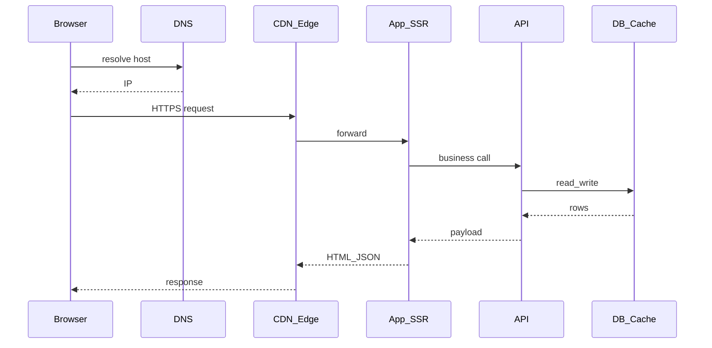

# Request path — путь запроса

> Актуальность: сентябрь 2026

## Роль в системе

Каноническая картинка «что происходит, когда пользователь нажал кнопку»: от клиента до хранилища и обратно. Это общий язык для фронта, бека, данных и инфраструктуры.

## Схема

## Что нужно знать (80/20)

- Типичная цепочка: DNS → CDN/edge → load balancer → app/SSR → API → DB/cache → ответ
- Где живёт **состояние**: cookie/session, JWT, server session, client cache
- Где возникают **границы доверия**: публичный интернет, edge, private network, DB
- Разница **синхронного** запроса и **фоновой** работы (очередь, webhook, cron)
- Что «latency» складывается из сети, CPU, IO и очередей — не только из «медленного SQL»

## Дочерние узлы

Пока нет — это листовой концепт уровня 2. Детали слоёв — в доменных разделах.

## Развилки

| Развилка | О чём спор (одна строка) |
| --- | --- |
| SSR/edge в пути vs чистый SPA + API | Где рендерить HTML и где держать секреты |
| Sync API vs async job | Нужен ли ответ «сейчас» или достаточно eventual |

## Связанные узлы

- Рендер: [01-frontend/rendering](../../01-frontend/rendering/)
- API: [02-backend/api-styles](../../02-backend/api-styles/)
- Сеть: [04-infrastructure/networking](../../04-infrastructure/networking/)
- Observability пути: [06-quality/observability](../../06-quality/observability/)
