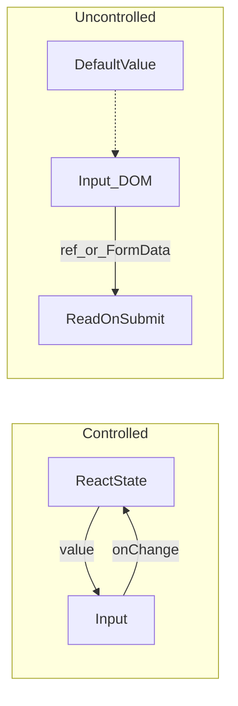

# Controlled inputs — контролируемые и неконтролируемые инпуты

> Актуальность: сентябрь 2026

## Роль в системе

Модель владения значением поля формы: React state как источник правды vs DOM/`ref` как источник. Архитектурно это контракт формы с валидацией, масками и синхронизацией с сервером — не «синтаксис input».

## Схема

## Что нужно знать (80/20)

- Controlled: `value` + `onChange` → state React; каждый ввод = ре-рендер владельца state
- Uncontrolled: начальное значение + чтение через `ref` / FormData при submit; меньше ре-рендеров, меньше live-валидации «из коробки»
- Поднятие state: общий источник для связанных полей живёт у предка или в form-library
- Смешение controlled/uncontrolled на одном поле (то `value`, то нет) — источник багов
- Валидация на каждое нажатие vs на blur/submit — UX и стоимость ре-рендеров
- Нативные формы + progressive enhancement vs полностью controlled SPA-формы
- Библиотеки форм (React Hook Form и др.) часто держат uncontrolled/подписочную модель ради перфоманса — понимать trade-off, не копировать API вслепую

## Дочерние узлы

Пока нет — лист.

## Развилки

| Развилка | О чём спор (одна строка) |
| --- | --- |
| Controlled vs uncontrolled | Живая синхронизация UI/валидации vs простота и меньше ре-рендеров |
| Свой state формы vs form library | Контроль и прозрачность vs перфоманс и boilerplate |
| Submit через FormData vs controlled JSON API | Близость к HTML vs единый клиентский контракт |

## Связанные узлы

- Родитель component: [../](../)
- Composition: [../composition/](../composition/)
- Hooks: [../../hooks/](../../hooks/)
- Patterns: [../../patterns/](../../patterns/)
- A11y: [../../../../accessibility/](../../../../accessibility/)
- UI: [../../../../ui/](../../../../ui/)
