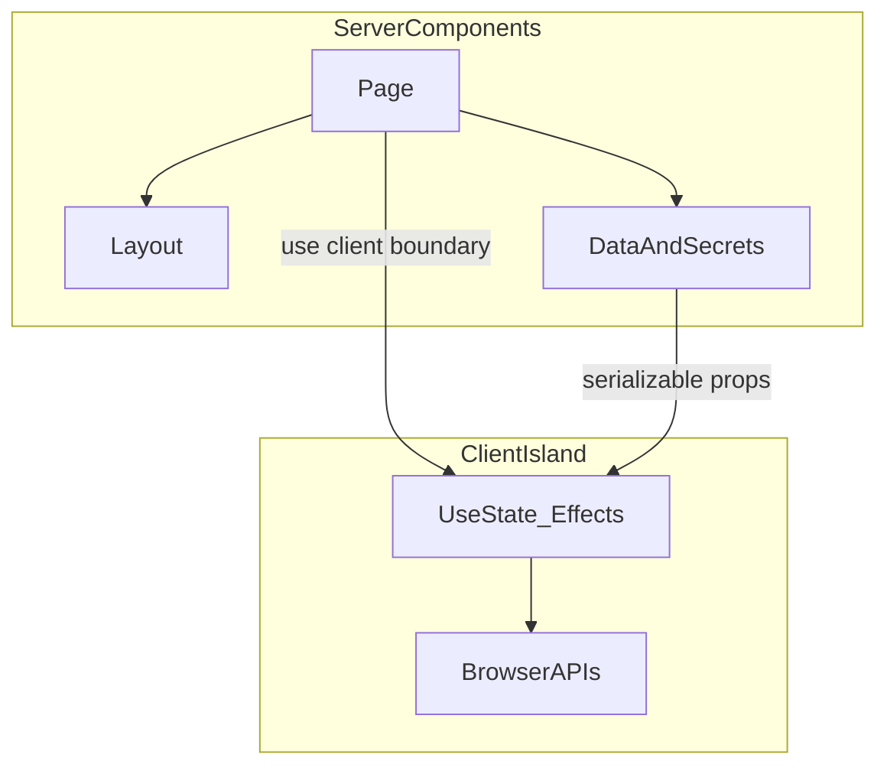

# Server / Client boundary — граница Server и Client Components

> Актуальность: сентябрь 2026

## Роль в системе

В мета-стеках с React Server Components (часто Next.js) — линия, где заканчивается серверный рендер без клиентского JS и начинается интерактивный остров. Архитектурно это граница доверия, бандла и того, где можно держать секреты и эффекты.

## Схема

## Что нужно знать (80/20)

- Server Component по умолчанию в RSC-модели: нет `useState`/`useEffect`, нет браузерных API; можно читать данные и секреты на сервере
- Client Component (`"use client"`) — граница гидрации: всё ниже в этом модуле — клиентский граф (с оговорками по импортам)
- Секреты и прямой доступ к БД — только на сервере; на клиент уходит уже безопасный снимок
- Передача через границу: сериализуемые props; функции/классы/сложные объекты — нет (или через согласованные паттерны стека)
- Интерактивность и подписки — на client; статичная разметка и data-fetch «до UI» — на server, где уместно
- Острова: тянуть `"use client"` как можно ниже, чтобы не раздувать бандл всего дерева
- React ≠ автоматически RSC: граница появляется в meta-framework / рантайме с поддержкой RSC

## Дочерние узлы

Пока нет — лист. Детали рендера — в слое [rendering](../../../../rendering/); Next.js: [meta-frameworks/nextjs](../../../../meta-frameworks/nextjs/).

## Развилки

| Развилка | О чём спор (одна строка) |
| --- | --- |
| Client island vs толстый Client tree | Меньше JS vs простота «всё интерактивно» |
| Fetch на Server Component vs client query library | Свежесть/секретность на сервере vs кэш и UX на клиенте |
| SPA без RSC vs App Router / RSC | Предсказуемый клиентский граф vs серверные границы по умолчанию |

## Связанные узлы

- Родитель component: [../](../)
- React: [../../](../../)
- Рендер: [../../../../rendering/](../../../../rendering/)
- Мета-фреймворки: [../../../../meta-frameworks/](../../../../meta-frameworks/)
- Next.js: [../../../../meta-frameworks/nextjs/](../../../../meta-frameworks/nextjs/)
- Data fetching: [../../../../data-fetching/](../../../../data-fetching/)
- Request path: [../../../../../00-system/request-path/](../../../../../00-system/request-path/)
