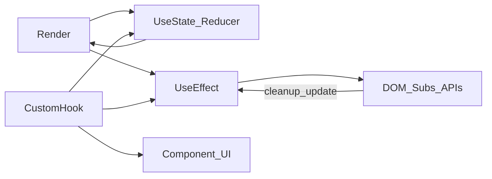

# Hooks — React Hooks

> Актуальность: сентябрь 2026

## Роль в системе

Механизм переиспользования логики между компонентами без наследования: состояние, эффекты, подписки и доступ к контексту живут в функциях-хуках. Архитектурно hooks — граница «логика vs разметка», не замена data layer.

## Схема

## Что нужно знать (80/20)

- Правила вызова: только на верхнем уровне компонента/кастомного хука; порядок стабилен между рендерами
- `useState` / `useReducer` — локальное UI-состояние; не серверная правда о данных
- `useEffect` — синхронизация с внешним миром (DOM, подписки, imperative API), не «место для бизнес-логики»
- Кастомный хук = именованный контракт переиспользуемой логики; возвращает данные и колбэки, не JSX
- Зависимости эффекта: что реально входит в замыкание; лишние/пропущенные deps ломают корректность
- `useRef` — мутабельный «карман» без ре-рендера (DOM-ноды, таймеры, предыдущие значения)
- `useMemo` / `useCallback` — оптимизация стабильности ссылок и дорогих вычислений; не дефолт на каждый prop
- В Server Components большинство хуков с состоянием/эффектами недоступны — граница client

## Дочерние узлы

Пока нет — лист уровня hooks. Детали паттернов композиции — в [patterns](../patterns/); граница server/client — в [server-client-boundary](../component/server-client-boundary/).

## Развилки

| Развилка | О чём спор (одна строка) |
| --- | --- |
| Логика в компоненте vs кастомный хук | Локальность фичи vs переиспользование и тестируемость |
| Effect для data fetch vs query library / RSC | Контроль в UI vs кэш, дедуп и серверная загрузка |
| useMemo/useCallback везде vs по профилю | Стабильность ссылок vs шум и ложное чувство «оптимизации» |

## Связанные узлы

- Родитель React: [../](../)
- Component: [../component/](../component/)
- Context: [../context/](../context/)
- State (слой): [../../../state/](../../../state/)
- Data fetching: [../../../data-fetching/](../../../data-fetching/)
- Рендер/RSC: [../../../rendering/](../../../rendering/)
