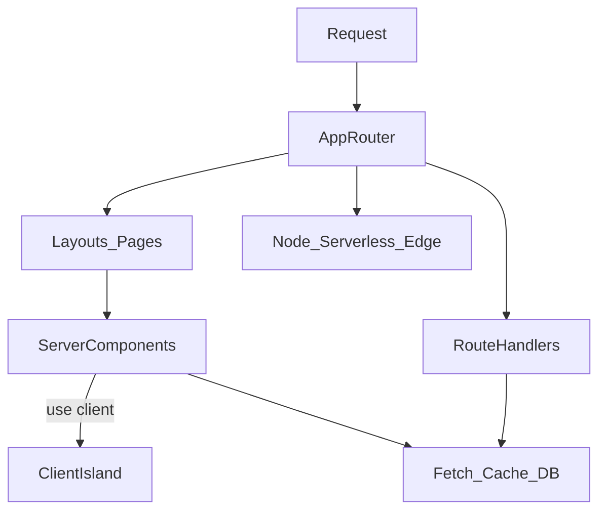

# Next.js

> Актуальность: сентябрь 2026

## Роль в системе

Доминирующий meta-framework для React: файловый App Router, Server Components, data/cache на сервере, Route Handlers и адаптеры деплоя. Архитектурно это решение «как устроено приложение целиком», а не «библиотека UI».

## Схема

## Что нужно знать (80/20)

- Next ≠ React: фреймворк приложения (роутинг, SSR/RSC, деплой) vs библиотека компонентов
- App Router — дефолтная ментальная модель 2026; Pages Router ещё встречается в легаси
- Server Components по умолчанию; клиентский JS — острова за `"use client"`
- Где живут данные и кэш (сервер/фреймворк) vs клиентские query-библиотеки
- Route Handlers / Server Actions — серверные точки входа рядом с UI-деревом
- Модель деплоя (Node, serverless, edge) влияет на кэш, холодный старт и vendor coupling
- Ориентир индустрии, не единственный стек: Vite SPA + отдельный API остаётся валидной развилкой

## Дочерние узлы

- [routing](./routing/) — файловое дерево, layouts, handlers vs pages
- [data-caching](./data-caching/) — fetch, revalidate, где правда о данных
- [deployment-model](./deployment-model/) — Node / serverless / edge и связка с хостингом

## Развилки

| Развилка | О чём спор (одна строка) |
| --- | --- |
| Next App Router vs Vite SPA + API | Скорость каркаса vs явные границы фронт/бек |
| Server fetch/cache vs TanStack Query на клиенте | TTFB и секреты vs интерактивный кэш и UX |
| Vercel-native vs self-host / Docker | Удобство платформы vs портабельность |

## Связанные узлы

- Родитель: [meta-frameworks](../)
- Рендер: [rendering](../../rendering/)
- Граница RSC: [frameworks/react/component/server-client-boundary](../../frameworks/react/component/server-client-boundary/)
- Data fetching (слой): [data-fetching](../../data-fetching/)
- Хостинг: [04-infrastructure/hosting](../../../04-infrastructure/hosting/)
- React: [frameworks/react](../../frameworks/react/)
