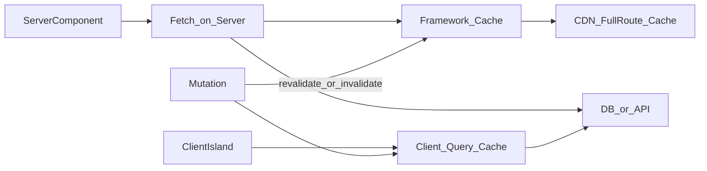

# Data caching — данные и кэш в Next.js

> Актуальность: сентябрь 2026

## Роль в системе

Где и как долго живёт результат fetch/рендера: на сервере фреймворка, на CDN, в клиентском кэше. Архитектурно это вопрос «где правда о данных» и цены устаревания.

## Схема

## Что нужно знать (80/20)

- Серверный fetch в RSC может участвовать в кэше фреймворка; семантика (static vs dynamic) менялась между мажорными версиями — сверять актуальный контракт
- Revalidation: по времени, по тегу/пути, после мутации — иначе UI врёт
- Full route cache / static shell vs полностью динамический запрос на каждый hit
- Секреты и персональные данные — не в публичный CDN-кэш; граница доверия
- Client query library (TanStack Query и др.) — другой слой правды: отлично для интерактива, дублирует серверный кэш если не договориться
- Deduping одинаковых fetch в одном дереве рендера — свойство серверного графа, не «магия HTTP»
- Ошибки и loading на сегментах роутера — часть модели данных UX, не только «try/catch в fetch»

## Дочерние узлы

Пока нет — лист. Общий слой фронта: [data-fetching](../../../data-fetching/).

## Развилки

| Развилка | О чём спор (одна строка) |
| --- | --- |
| Кэш фреймворка vs всегда dynamic | TTFB и стоимость origin vs свежесть |
| Server truth vs client query cache | Меньше JS и секреты vs UX списков/мутаций |
| Tag revalidate vs time-based ISR-like | Точность инвалидации vs простота |

## Связанные узлы

- Родитель Next.js: [../](../)
- Routing: [../routing/](../routing/)
- Data fetching (слой): [../../../data-fetching/](../../../data-fetching/)
- State: [../../../state/](../../../state/)
- Cache (данные): [../../../../03-data/cache/](../../../../03-data/cache/)
