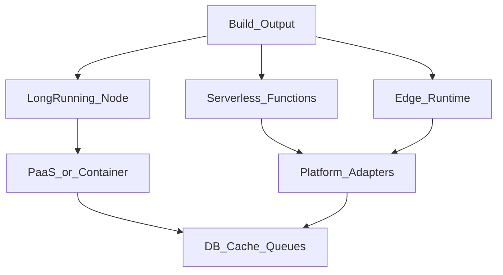

# Deployment model — модель деплоя Next.js

> Актуальность: сентябрь 2026

## Роль в системе

Куда и как исполняется Next-приложение: long-running Node, serverless functions, edge. Архитектурно деплой определяет лимиты, холодный старт, где можно держать соединения с БД и насколько силён vendor coupling.

## Схема

## Что нужно знать (80/20)

- Output/адаптеры: платформенный деплой vs self-host (Docker/Node server)
- Serverless: scale-to-zero и изоляция vs cold start, лимиты времени/памяти, осторожность с connection pools к БД
- Edge: низкая latency у пользователя vs урезанный рантайм и не всё из Node API
- Streaming SSR и RSC требуют рантайма, который умеет долго держать ответ — не любой «function timeout»
- Preview deployments — часть продуктового цикла; см. CI preview-rollout
- Vendor coupling: удобство одной платформы vs переносимость билда
- Статика/CDN для ассетов и части маршрутов — отдельно от динамического origin

## Дочерние узлы

Пока нет — лист.

## Развилки

| Развилка | О чём спор (одна строка) |
| --- | --- |
| PaaS «под Next» vs контейнер self-host | Скорость поставки vs контроль сети и cost |
| Serverless vs always-on Node | Cost на простое vs предсказуемые соединения с БД |
| Edge для всего vs edge только для shell | Latency vs совместимость и сложность |

## Связанные узлы

- Родитель Next.js: [../](../)
- Хостинг: [../../../../04-infrastructure/hosting/](../../../../04-infrastructure/hosting/)
- Containers: [../../../../04-infrastructure/containers/](../../../../04-infrastructure/containers/)
- Docker: [../../../../04-infrastructure/containers/docker/](../../../../04-infrastructure/containers/docker/)
- Preview/rollout: [../../../../05-cicd/preview-rollout/](../../../../05-cicd/preview-rollout/)
- Pipeline stages: [../../../../05-cicd/pipeline/stages/](../../../../05-cicd/pipeline/stages/)
- Request path: [../../../../00-system/request-path/](../../../../00-system/request-path/)
