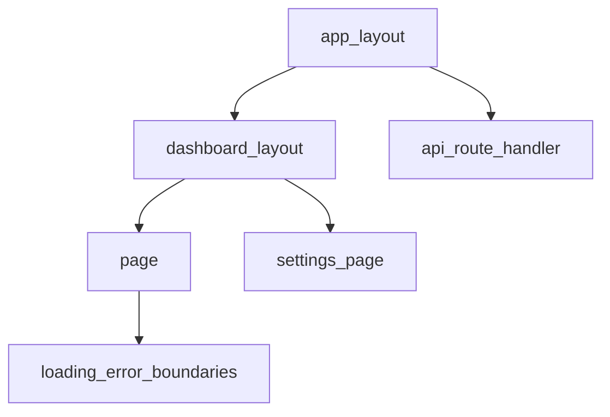

# Routing — роутинг Next.js (App Router)

> Актуальность: сентябрь 2026

## Роль в системе

Файловая карта URL → UI и серверные точки входа. Архитектурно роутинг задаёт границы layouts, вложенность данных и где живут API-эндпоинты рядом с страницами.

## Схема

## Что нужно знать (80/20)

- Папки в `app/` = сегменты URL; `page`, `layout`, `loading`, `error`, `not-found` — специальные файлы
- Nested layouts сохраняют UI при навигации по детям; понимание «что ре-рендерится» критично
- Dynamic segments, catch-all, route groups `(marketing)` — структура без обязательного сегмента в URL
- Parallel / intercepting routes — для модалок и сложных shell; цена сложности
- Route Handlers (`route.ts`) — HTTP-эндпоинты в том же дереве, не «отдельный Express по умолчанию»
- Server Actions / формы — мутации с сервера без обязательного отдельного REST-ресурса
- Клиентская навигация vs полный document request — кэш роутера и soft navigation

## Дочерние узлы

Пока нет — лист.

## Развилки

| Развилка | О чём спор (одна строка) |
| --- | --- |
| Всё в App Router vs отдельный API-сервис | Колокация vs жёсткая граница команд/деплоев |
| Route groups vs много layout-файлов | Чистая URL-схема vs читаемость дерева |
| Soft navigation cache vs всегда свежий SSR | UX скорости vs предсказуемость данных |

## Связанные узлы

- Родитель Next.js: [../](../)
- Data-caching: [../data-caching/](../data-caching/)
- Server/client boundary: [../../../frameworks/react/component/server-client-boundary/](../../../frameworks/react/component/server-client-boundary/)
- Рендер: [../../../rendering/](../../../rendering/)
