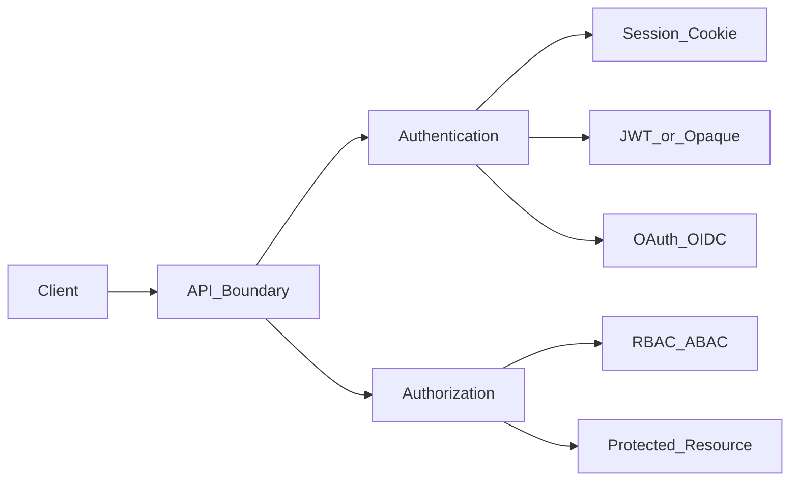

# Auth — аутентификация и авторизация (API)

> Актуальность: сентябрь 2026

## Роль в системе

**Каноническое место** темы auth на уровне API: кто пользователь, что ему можно. Продуктовый IdP/SSO — см. product-adjacent/identity; здесь — серверные механики.

## Схема

## Что нужно знать (80/20)

- Authentication ≠ Authorization
- Сессии (cookie) vs bearer tokens (JWT/opaque); refresh/rotation
- OAuth2 / OIDC на уровне ролей: Authorization Server, Resource Server, Client
- RBAC / ABAC; проверка на границе сервиса и на доменном уровне
- Секреты, ключи подписи, clock skew; никогда не доверять клиенту «роль в payload» без проверки подписи/сессии
- Service-to-service: mTLS, signed tokens, network policy

## Дочерние узлы

- [sessions](./sessions/) — cookie-сессии, store, отзыв, CSRF/SameSite
- [jwt](./jwt/) — bearer, claims, refresh/rotation, отзыв vs TTL
- [oauth-oidc](./oauth-oidc/) — роли AS / RS / Client; OIDC login
- [rbac-abac](./rbac-abac/) — роли vs атрибуты; граница API vs домен

## Развилки

| Развилка | О чём спор (одна строка) |
| --- | --- |
| Session cookie vs JWT | Отзыв и простота vs stateless и мобильные клиенты |
| Build auth vs buy IdP | Контроль vs security/compliance и time-to-market |

## Связанные узлы

- Identity (продукт): [07-product-adjacent/identity](../../07-product-adjacent/identity/)
- Security: [06-quality/security](../../06-quality/security/)
- Browser cookies: [01-frontend/browser-platform](../../01-frontend/browser-platform/)
- Backend: [../](../)
