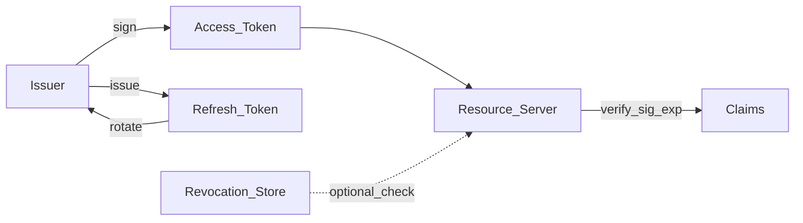

# JWT — JSON Web Tokens

> Актуальность: сентябрь 2026

## Роль в системе

Подписанный (иногда зашифрованный) bearer-токен с claims. Архитектурно JWT — способ перенести доказательство identity между сторонами; не замена модели авторизации и не «бесплатный stateless без цены».

## Схема

## Что нужно знать (80/20)

- Структура: header.payload.signature; доверять только после проверки подписи, `iss`, `aud`, `exp`
- Access короткий TTL; refresh — отдельный секрет с rotation и хранением/отзывом на сервере
- «Stateless» относительно session store, но отзыв до истечения TTL требует blocklist/version или короткого TTL
- Не класть секреты и PII в payload; роли в токене — кэш утверждений, не истина без политики проверки
- Алгоритмы: асимметрия (RS/ES) удобна для многих RS; `none` и путаница alg — классическая дыра
- Хранение на клиенте: memory / cookie vs `localStorage` (XSS); для браузера часто спор со session cookie
- Opaque token + introspection — альтернатива, когда RS не должен парсить JWT сам

## Дочерние узлы

Пока нет — лист.

## Развилки

| Развилка | О чём спор (одна строка) |
| --- | --- |
| JWT access vs opaque reference token | Локальная проверка vs централизованный отзыв |
| Короткий TTL без revoke vs revoke store | Простота ops vs мгновенный logout |

## Связанные узлы

- Родитель auth: [../](../)
- Sessions: [../sessions/](../sessions/)
- OAuth/OIDC: [../oauth-oidc/](../oauth-oidc/)
- RBAC/ABAC: [../rbac-abac/](../rbac-abac/)
- Security: [../../../06-quality/security/](../../../06-quality/security/)
- Identity: [../../../07-product-adjacent/identity/](../../../07-product-adjacent/identity/)
