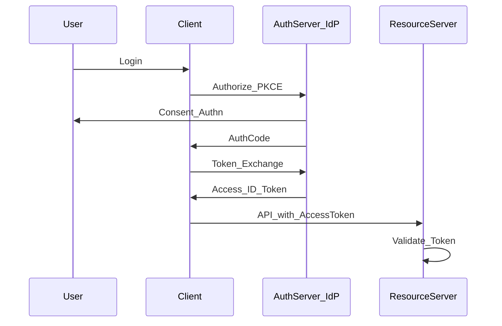

# OAuth / OIDC

> Актуальность: сентябрь 2026

## Роль в системе

Протоколы делегирования доступа (OAuth 2) и входа с identity claims (OIDC). Архитектурно это разделение ролей Client / Authorization Server / Resource Server, а не «кнопка Login with Google».

## Схема

## Что нужно знать (80/20)

- OAuth 2 — authorization framework; OIDC — identity layer поверх (ID Token, UserInfo)
- Роли: Client (приложение), AS/IdP (выдаёт токены), RS (API защищает ресурс)
- Authorization Code + PKCE — дефолт для публичных клиентов 2026; implicit устарел
- ID Token ≠ Access Token: кто пользователь vs доступ к API; путать опасно
- Scopes — грубые разрешения клиента; тонкая авторизация ресурса — отдельно (RBAC/ABAC)
- Self-hosted AS vs hosted IdP — продуктовый выбор; механики токенов всё равно нужно понимать
- Machine-to-machine: client credentials; user-delegated — другие grant'ы и threat model

## Дочерние узлы

Пока нет — лист.

## Развилки

| Развилка | О чём спор (одна строка) |
| --- | --- |
| Hosted IdP vs свой Authorization Server | Time-to-market и compliance vs контроль и cost |
| First-party cookie session vs OIDC для своего SPA | Простота монолита vs единый протокол с мобильными/партнёрами |

## Связанные узлы

- Родитель auth: [../](../)
- JWT: [../jwt/](../jwt/)
- Sessions: [../sessions/](../sessions/)
- Identity (продукт): [../../../07-product-adjacent/identity/](../../../07-product-adjacent/identity/)
- Security: [../../../06-quality/security/](../../../06-quality/security/)
