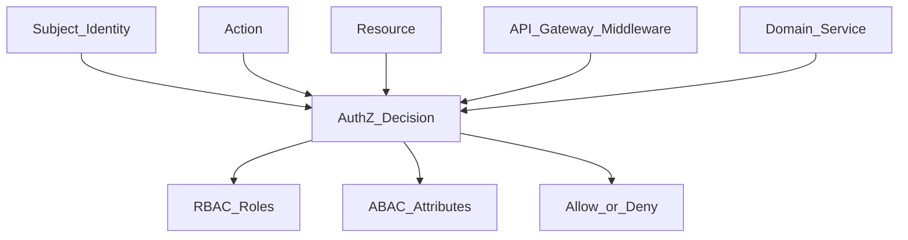

# RBAC / ABAC — авторизация

> Актуальность: сентябрь 2026

## Роль в системе

Решение «можно ли этому субъекту это действие над этим ресурсом». Архитектурно авторизация — политика на границе API и/или в домене; роли и атрибуты — способы выразить политику, не замена authentication.

## Схема

## Что нужно знать (80/20)

- Authentication даёт subject; Authorization отвечает на permission check
- RBAC: роли → permissions; просто для стабильных орг. иерархий; взрыв ролей — запах
- ABAC: атрибуты субъекта/ресурса/контекста (tenant, owner, time); гибче, сложнее аудитить
- Где проверять: edge/middleware (грубый deny) + домен (инварианты «свой заказ»); только edge часто дыряво
- Не доверять роли из клиентского payload без серверной проверки сессии/токена
- Multi-tenant: изоляция tenant id в каждом запросе к данным — часть authz, не только «роль admin»
- Политики как данные (ReBAC/ACL, OPA-подобные) — когда RBAC/ABAC в коде перестают масштабироваться

## Дочерние узлы

Пока нет — лист.

## Развилки

| Развилка | О чём спор (одна строка) |
| --- | --- |
| RBAC vs ABAC / ReBAC | Простота ролей vs гибкость атрибутов и связей |
| AuthZ только на edge vs в домене | Единая точка vs корректность инвариантов ресурса |

## Связанные узлы

- Родитель auth: [../](../)
- JWT: [../jwt/](../jwt/)
- Sessions: [../sessions/](../sessions/)
- OAuth/OIDC: [../oauth-oidc/](../oauth-oidc/)
- Identity (orgs): [../../../07-product-adjacent/identity/](../../../07-product-adjacent/identity/)
- Service boundaries: [../../service-boundaries/](../../service-boundaries/)
- Security: [../../../06-quality/security/](../../../06-quality/security/)
