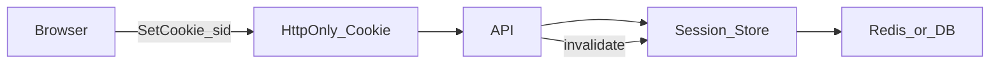

# Sessions — сессии

> Актуальность: сентябрь 2026

## Роль в системе

Сервер помнит факт входа: клиент держит session id (обычно в cookie), сервер — запись в store. Архитектурно это модель «отзываемая правда на сервере», удобная для браузерных приложений.

## Схема

## Что нужно знать (80/20)

- Session id — непрозрачный секрет; данные сессии на сервере, не в cookie payload
- Cookie: `HttpOnly`, `Secure`, `SameSite`; домен/path — часть границы доверия
- Store: память (только dev), Redis, БД; sticky sessions без shared store ломают scale-out
- Отзыв мгновенный: удалил запись — сессия мертва; logout / «выйти везде» — продуктовое требование
- CSRF: cookie автоматически едет с запросом — нужны SameSite и/или CSRF-токен для state-changing методов
- Фиксация и кража сессии: ротация id после login, короткий idle timeout, привязка к контексту по политике риска
- SPA + cookie session часто проще XSS-устойчивости, чем JWT в `localStorage`

## Дочерние узлы

Пока нет — лист.

## Развилки

| Развилка | О чём спор (одна строка) |
| --- | --- |
| Cookie session vs bearer token | Отзыв и CSRF-дисциплина vs удобство API/mobile клиентов |
| Redis session vs DB session | Latency и TTL vs меньше зависимостей |

## Связанные узлы

- Родитель auth: [../](../)
- JWT: [../jwt/](../jwt/)
- OAuth/OIDC: [../oauth-oidc/](../oauth-oidc/)
- Browser cookies: [../../../01-frontend/browser-platform/](../../../01-frontend/browser-platform/)
- Cache/Redis: [../../../03-data/cache/](../../../03-data/cache/)
- Security: [../../../06-quality/security/](../../../06-quality/security/)
