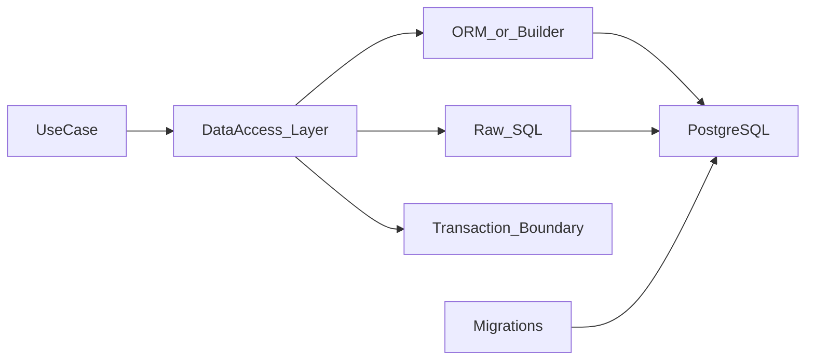

# Data access — доступ к данным

> Актуальность: сентябрь 2026

## Роль в системе

Как приложение читает/пишет БД: SQL, query builders, ORM, миграции. Слой, где легко спрятать N+1 и потерять контроль над схемой.

## Схема

## Что нужно знать (80/20)

- Raw SQL / query builder / ORM — спектр контроля и абстракции
- Ориентир TS 2026: Drizzle часто хвалят за SQL-clarity; Prisma — зрелый workflow; оба валидны
- Миграции обязательны в CI; «синк схемы руками на проде» — антипаттерн
- Транзакции на уровне use-case; unit of work
- N+1, ленивые загрузки, явный select списка полей
- Репозиторий/DAO — граница, а не «бог-ORM везде»

## Дочерние узлы

- [orm-vs-sql](./orm-vs-sql/) — спектр ORM / builder / raw SQL
- [migrations](./migrations/) — эволюция схемы, CI, expand/contract
- [transactions](./transactions/) — границы use-case, изоляция, unit of work

Запланировано: n-plus-one.

## Развилки

| Развилка | О чём спор (одна строка) |
| --- | --- |
| ORM vs SQL-first | Скорость CRUD vs прозрачность запросов и перф |
| Auto-migrate vs reviewed migrations | DX локально vs контроль продакшена |

## Связанные узлы

- Modeling: [modeling](../modeling/)
- Postgres: [relational/postgres](../relational/postgres/)
- GraphQL N+1: [02-backend/api-styles/graphql](../../02-backend/api-styles/graphql/)
- Backend frameworks: [02-backend/frameworks](../../02-backend/frameworks/)
