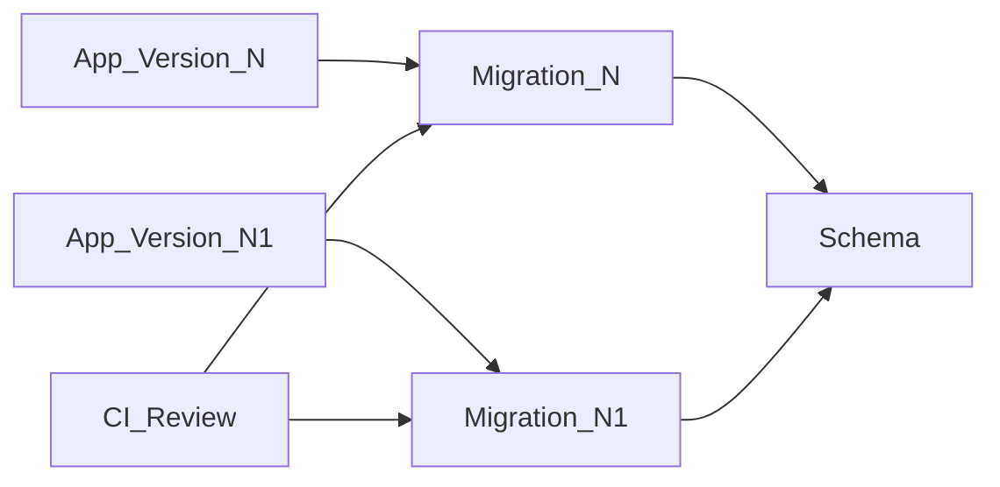

# Migrations — миграции схемы

> Актуальность: сентябрь 2026

## Роль в системе

Версионированное изменение схемы БД вместе с кодом. Архитектурно миграции — продукт: совместимость старого/нового приложения, downtime и откат, а не «нажать sync в ORM».

## Схема

## Что нужно знать (80/20)

- Миграции в VCS и CI; ручной DDL на проде без артефакта — антипаттерн
- Expand/contract: сначала совместимое расширение схемы, потом код, потом сжатие — безопасный деплой без даунтайма
- Reviewed migrations vs auto-generate diff: генерация — черновик; на проде нужен осознанный SQL
- Locking и long migrations: `CREATE INDEX CONCURRENTLY`, тяжёлые rewrite таблиц — отдельный план, не «в том же деплое незаметно»
- Rollback: не всегда `DOWN`; часто forward-fix + feature flag / dual-write окно
- Каноническое место стратегии миграций в справочнике — этот узел; modeling ссылается сюда
- Preview / branching DB (Neon-style и аналоги) ускоряют DX, но не отменяют дисциплину на проде

## Дочерние узлы

Пока нет — лист.

## Развилки

| Развилка | О чём спор (одна строка) |
| --- | --- |
| Auto-migrate vs reviewed SQL | DX локально vs контроль и предсказуемость прода |
| Downtime window vs online expand/contract | Простота операции vs непрерывность сервиса |

## Связанные узлы

- Родитель data-access: [../](../)
- ORM vs SQL: [../orm-vs-sql/](../orm-vs-sql/)
- Transactions: [../transactions/](../transactions/)
- Modeling: [../../modeling/](../../modeling/)
- Postgres: [../../relational/postgres/](../../relational/postgres/)
- Environments: [../../../04-infrastructure/environments/](../../../04-infrastructure/environments/)
