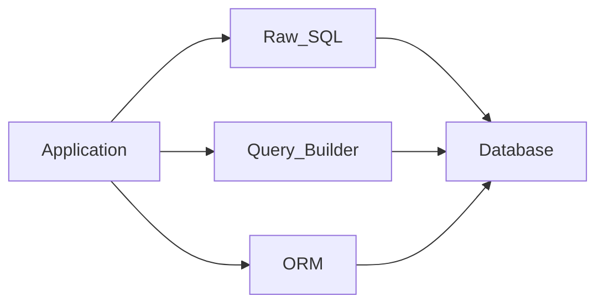

# ORM vs SQL — спектр доступа

> Актуальность: сентябрь 2026

## Роль в системе

Выбор, насколько абстрактно приложение говорит с БД: raw SQL, query builder, full ORM. Архитектурно это контроль над запросом и схемой vs скорость CRUD и смена диалекта.

## Схема

## Что нужно знать (80/20)

- Спектр, не бинарный выбор: один проект часто смешивает ORM для CRUD и SQL для горячих путей
- ORM даёт модель, миграции-workflow, type-safety; цена — скрытые запросы, N+1, сложный SQL «мимо» модели
- Query builder (Drizzle-like, Knex-like) — SQL близко к тексту, меньше магии, больше явного контроля
- Raw SQL — максимум прозрачности и перфа; дисциплина параметризации, маппинга и версионирования запросов
- Ориентир TS 2026: Drizzle часто за SQL-clarity; Prisma — зрелый schema/migrate DX; оба валидны как дефолт команды
- Граница репозитория/DAO изолирует выбор; «ORM везде в use-case» размазывает перф-проблемы
- Смена БД через ORM редко окупается; реальная цена — access patterns и транзакции

## Дочерние узлы

Пока нет — лист.

## Развилки

| Развилка | О чём спор (одна строка) |
| --- | --- |
| Full ORM vs SQL-first builder | Скорость фич и модель vs предсказуемые планы |
| Один стиль на весь код vs гибрид | Единообразие vs точечный контроль горячих запросов |

## Связанные узлы

- Родитель data-access: [../](../)
- Migrations: [../migrations/](../migrations/)
- Transactions: [../transactions/](../transactions/)
- Postgres: [../../relational/postgres/](../../relational/postgres/)
- Modeling: [../../modeling/](../../modeling/)
