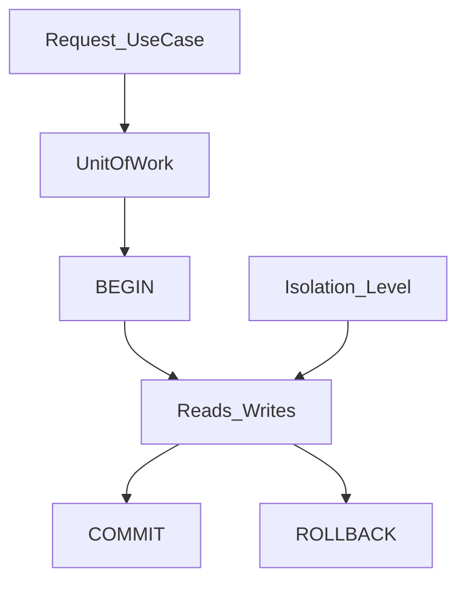

# Transactions — транзакции

> Актуальность: сентябрь 2026

## Роль в системе

Граница атомарности и изоляции для связанных записей. Архитектурно транзакция живёт на уровне use-case / unit of work, а не «обернуть каждый SQL в BEGIN».

## Схема

## Что нужно знать (80/20)

- Транзакция = бизнес-инвариант («заказ + списание» вместе), не техническая обёртка одного INSERT
- Unit of work: одна граница на use-case; вложенные «транзакции» в ORM часто savepoints — понимать семантику
- Уровни изоляции (read committed, repeatable read, serializable) — про аномалии и цену конфликтов; дефолт Postgres обычно достаточен, пока нет явной гонки
- Long transactions держат locks и мешают vacuum — антипаттерн для HTTP-request + внешние API внутри BEGIN
- Идемпотентность и retries: после сетевого сбоя неясно, прошёл ли COMMIT — нужны ключи идемпотентности
- Распределённые транзакции / 2PC почти никогда не нужны в вебе; saga / outbox — отдельные паттерны async
- Read-only пути и reporting часто вне жёсткой write-транзакции; replica lag — см. replication

## Дочерние узлы

Пока нет — лист.

## Развилки

| Развилка | О чём спор (одна строка) |
| --- | --- |
| Короткие DB-транзакции vs бизнес-процесс «в одном BEGIN» | Throughput и locks vs простота инварианта |
| Optimistic concurrency vs жёсткая изоляция | Меньше блокировок vs явная сериализация гонок |

## Связанные узлы

- Родитель data-access: [../](../)
- Migrations: [../migrations/](../migrations/)
- ORM vs SQL: [../orm-vs-sql/](../orm-vs-sql/)
- Modeling: [../../modeling/](../../modeling/)
- Postgres replication: [../../relational/postgres/replication/](../../relational/postgres/replication/)
- Backend async: [../../../02-backend/async/](../../../02-backend/async/)
