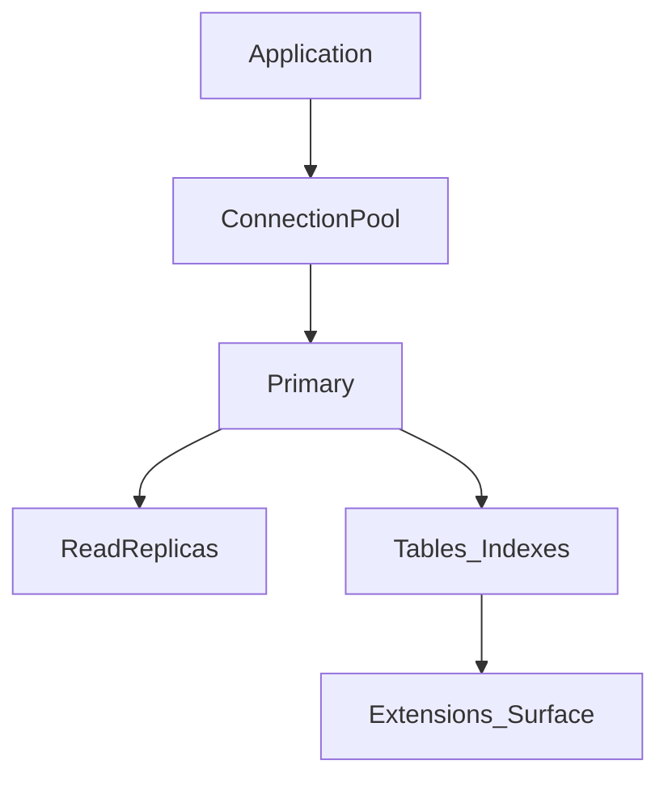

# PostgreSQL

> Актуальность: сентябрь 2026

## Роль в системе

Самый частый выбор OLTP system of record в веб/SaaS 2026. Зрелая SQL-СУБД + JSONB, FTS, расширения (PostGIS, pgvector). Уметь «думать Postgres» важнее, чем знать все флаги.

## Схема

## Что нужно знать (80/20)

- Роль: источник истины, транзакции, ограничения целостности
- Индексы (B-tree и когда нужны другие), EXPLAIN на уровне «уметь читать»
- MVCC и следствия для long transactions / bloat (концептуально)
- Пул соединений (PgBouncer и аналоги); лимиты serverless Postgres
- Бэкапы, PITR, реплики — часть архитектуры, не «потом ops»
- Когда выносить нагрузку: кэш, search, OLAP, отдельный vector store

## Дочерние узлы

- [indexing](./indexing/) — планы запросов, типы индексов, цена записи
- [replication](./replication/) — replicas, lag, failover vs scale reads
- [extensions](./extensions/) — PostGIS, pgvector, FTS; ядро vs вынос

Запланировано: serverless-postgres.

## Развилки

| Развилка | О чём спор (одна строка) |
| --- | --- |
| Vanilla Postgres vs Supabase/Neon-style | Контроль vs auth/storage/branching из коробки |
| pgvector in Postgres vs dedicated vector DB | Операционная простота vs спец. масштаб embeddings |

## Связанные узлы

- Relational: [relational](../)
- Data access: [data-access](../../data-access/)
- Vectors: [vectors](../../vectors/)
- Cache: [cache](../../cache/)
- Environments/preview DB: [04-infrastructure/environments](../../../04-infrastructure/environments/)
