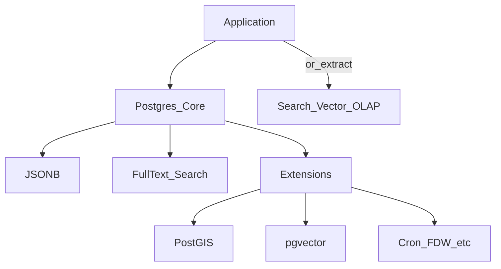

# Extensions — расширения PostgreSQL

> Актуальность: сентябрь 2026

## Роль в системе

Расширения добавляют типы, индексы и функции поверх ядра Postgres. Архитектурно это вопрос «оставить нагрузку в SoR» vs «вынести в специализированный store» — с ценой ops и vendor surface.

## Схема

## Что нужно знать (80/20)

- Ядро уже сильно: JSONB, ограничения, транзакции, обычный SQL — расширение не первый рычаг
- PostGIS — гео и пространственные запросы; тяжёлый ops/поверхность, но один стек с OLTP
- pgvector — embeddings рядом с бизнес-данными; ANN-индексы и лимиты масштаба — см. vectors
- FTS (tsvector / GIN) — достаточно для многих продуктов; отдельный search engine — при релевантности, фасетах, огромном корпусе
- Managed Postgres: не все расширения доступны; branching/serverless платформы сужают список
- Extension = зависимость апгрейда и бэкапа; «поставили и забыли» ломается на major upgrade
- Когда выносить: другая SLA/scale, другая команда, несовместимая модель консистентности

## Дочерние узлы

Пока нет — лист.

## Развилки

| Развилка | О чём спор (одна строка) |
| --- | --- |
| FTS/pgvector/PostGIS in Postgres vs dedicated store | Один ops и транзакции vs спец. масштаб и фичи |
| Максимум в SoR vs полиглот persistence | Простота эксплуатации vs fit нагрузки |

## Связанные узлы

- Родитель Postgres: [../](../)
- Indexing: [../indexing/](../indexing/)
- Vectors: [../../../vectors/](../../../vectors/)
- Search: [../../../search/](../../../search/)
- Analytics: [../../../analytics/](../../../analytics/)
