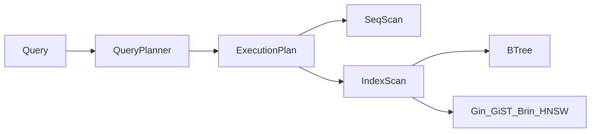

# Indexing — индексы PostgreSQL

> Актуальность: сентябрь 2026

## Роль в системе

Индекс — структура, которая ускоряет поиск ценой места и стоимости записи. Архитектурно это решение «какой access pattern оплачиваем заранее», а не «добавить INDEX на всё».

## Схема

## Что нужно знать (80/20)

- Индекс обслуживает конкретный predicate / JOIN / ORDER BY; без access pattern индекс — налог на write
- B-tree — дефолт для равенства и диапазонов; GIN/GiST — JSONB, FTS, гео; BRIN — большие append-only таблицы; ANN (HNSW и др.) — vectors
- Composite и partial indexes: порядок колонок и `WHERE` в индексе важнее «больше колонок»
- Covering / INCLUDE — меньше heap fetches; цена размера индекса
- EXPLAIN (ANALYZE) — навык решения: seq scan не всегда плохо; index scan не всегда дёшев
- Unique / PK — и целостность, и путь доступа; FK без индекса на referencing side часто бьёт deletes/updates
- Write amplification: каждый индекс обновляется на INSERT/UPDATE/DELETE; bloat и vacuum — следствия нагрузки

## Дочерние узлы

Пока нет — лист.

## Развилки

| Развилка | О чём спор (одна строка) |
| --- | --- |
| Много узких индексов vs меньше широких | Точность под запросы vs стоимость записи и места |
| Partial / expression index vs денормализация | Точность в БД vs упрощение запросов в приложении |

## Связанные узлы

- Родитель Postgres: [../](../)
- Replication: [../replication/](../replication/)
- Extensions: [../extensions/](../extensions/)
- Data access: [../../../data-access/](../../../data-access/)
- Modeling: [../../../modeling/](../../../modeling/)
