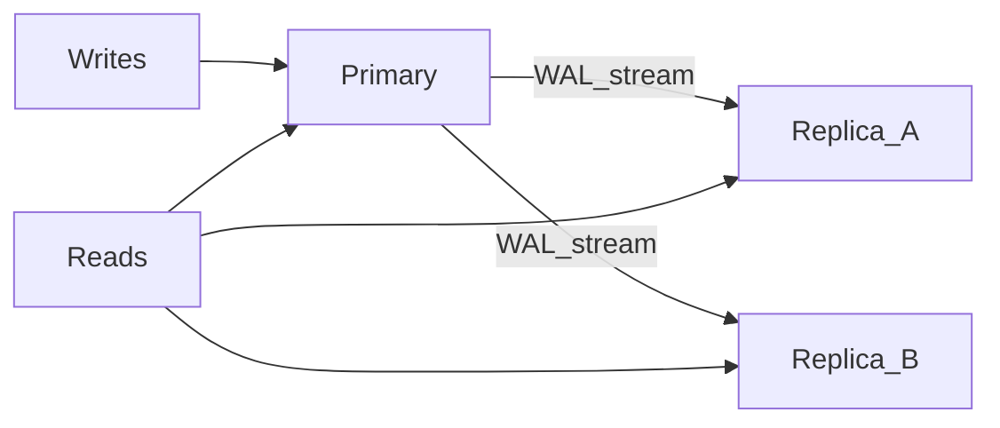

# Replication — репликация PostgreSQL

> Актуальность: сентябрь 2026

## Роль в системе

Копии данных с primary: масштабирование чтения, отказоустойчивость, географическая близость. Архитектурно репликация — про consistency lag и роль узла, а не «бесплатные дополнительные инстансы».

## Схема

## Что нужно знать (80/20)

- Streaming replication: primary пишет WAL, replicas применяют; sync vs async — latency vs RPO
- Read replicas разгружают SELECT, но не снимают нагрузку записи и не заменяют шардинг
- Replication lag: чтение «своей» только что записанной строки с replica может вернуть старое
- Failover / promote replica — процедура и detection, не только «включить HA в панели»
- Logical replication — выборочные таблицы, CDC, миграции между мажорами; другая модель, чем physical
- Connection routing: кто решает primary vs replica (приложение, pooler, proxy) — часть дизайна
- Бэкапы и PITR ортогональны, но связаны: replica ≠ единственная стратегия восстановления

## Дочерние узлы

Пока нет — лист.

## Развилки

| Развилка | О чём спор (одна строка) |
| --- | --- |
| Async replicas vs sync commit | Throughput и latency vs жёсткий RPO |
| Scale reads via replicas vs кэш / read-model | Свежесть SQL vs сложность инвалидации |

## Связанные узлы

- Родитель Postgres: [../](../)
- Indexing: [../indexing/](../indexing/)
- Cache: [../../../cache/](../../../cache/)
- Reliability: [../../../../06-quality/reliability/](../../../../06-quality/reliability/)
- Environments: [../../../../04-infrastructure/environments/](../../../../04-infrastructure/environments/)
