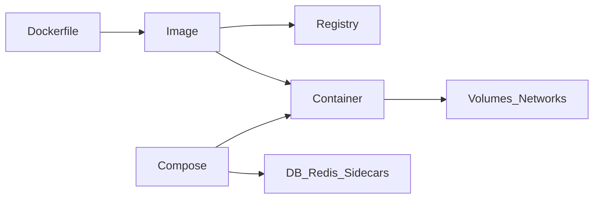

# Docker

> Актуальность: сентябрь 2026

## Роль в системе

Де-факто инструмент сборки и локального запуска контейнеров. Понимать Docker-модель важнее синтаксиса всех флагов `run`.

## Схема

## Что нужно знать (80/20)

- Image / container / volume / network
- Dockerfile: FROM, COPY, RUN, CMD/ENTRYPOINT; multi-stage
- Compose для локального стека (app + db + redis)
- Разница dev bind-mount и prod immutable image
- Ресурсы: CPU/memory limits; логи в stdout
- Безопасность: не root, секреты не в слоях образа

## Дочерние узлы

- [dockerfile](./dockerfile/) — слои, multi-stage, non-root, граница образа
- [compose](./compose/) — локальный стек; dev mount vs prod image

## Развилки

| Развилка | О чём спор (одна строка) |
| --- | --- |
| Docker Desktop vs native engines | Удобство на Windows/Mac vs лицензии и альтернативы |
| One container per process vs sidecar | Простота vs разделение concerns (proxy, agent) |

## Связанные узлы

- Containers: [containers](../)
- CI build: [05-cicd/pipeline](../../../05-cicd/pipeline/)
- Supply chain: [05-cicd/supply-chain](../../../05-cicd/supply-chain/)
- Hosting: [../../hosting/](../../hosting/)
