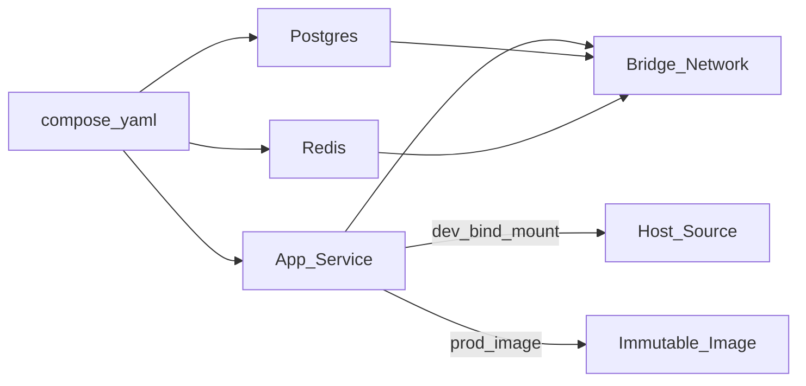

# Compose — Docker Compose

> Актуальность: сентябрь 2026

## Роль в системе

Описание локального (и иногда простого prod-like) стека сервисов: app + БД + кэш в одном файле. Архитектурно Compose — контракт «как поднять систему целиком», не замена оркестрации в кластере.

## Схема

## Что нужно знать (80/20)

- Services, networks, volumes, depends_on — топология стека, не «магия Docker»
- Dev: bind-mount исходников + hot reload; prod-like: тот же образ, что уйдёт в registry
- Env files и secrets: не коммитить прод-секреты; разные compose override для профилей
- Healthchecks и порядок старта: app ждать ready БД, не только started контейнер
- Порты на хост — удобство локалки; в shared network сервисы ходят по имени сервиса
- Compose ≠ Kubernetes: масштаб, самолечение, rolling — другая модель (см. orchestration)
- Один compose на команду снижает «подними вручную Postgres 16 и Redis»

## Дочерние узлы

Пока нет — лист.

## Развилки

| Развилка | О чём спор (одна строка) |
| --- | --- |
| Compose только для local vs Compose на VPS | DX команды vs простота маленького prod |
| Bind-mount dev vs всегда image как в CI | Скорость итерации vs паритет с пайплайном |

## Связанные узлы

- Родитель Docker: [../](../)
- Dockerfile: [../dockerfile/](../dockerfile/)
- Environments: [../../../environments/](../../../environments/)
- Orchestration: [../../../orchestration/](../../../orchestration/)
- Cache/Redis: [../../../../03-data/cache/](../../../../03-data/cache/)
- Postgres: [../../../../03-data/relational/postgres/](../../../../03-data/relational/postgres/)
