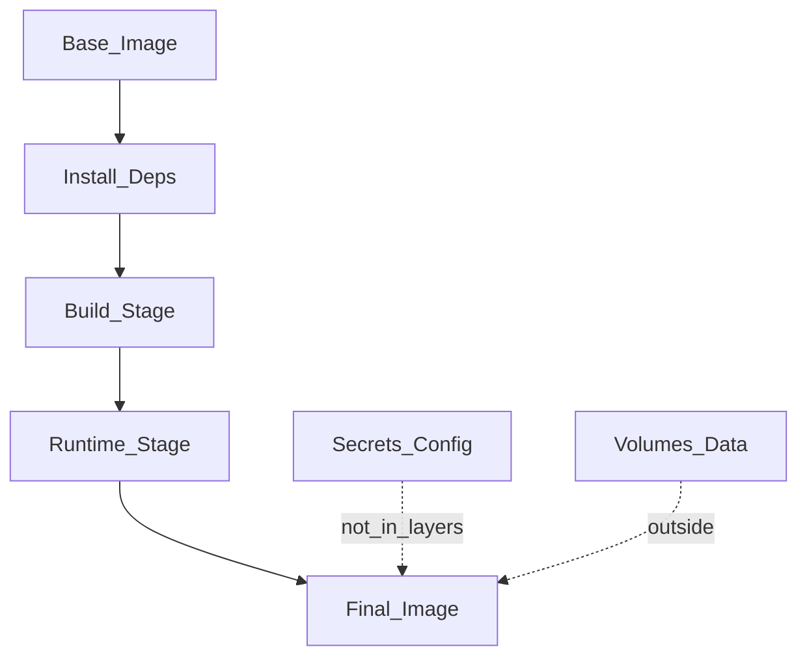

# Dockerfile

> Актуальность: сентябрь 2026

## Роль в системе

Рецепт сборки образа: слои, base, entrypoint. Архитектурно Dockerfile фиксирует, что внутри артефакта поставки, а что приходит снаружи (конфиг, секреты, данные).

## Схема

## Что нужно знать (80/20)

- Слои кэшируются сверху вниз: порядок инструкций = скорость rebuild в CI
- Multi-stage: тяжёлый toolchain в build-stage, тонкий runtime — меньше поверхность и размер
- `COPY`/`ADD` только нужное; `.dockerignore` — часть контракта, не «мелочь»
- Non-root USER; read-only rootfs где возможно; секреты не через `ENV`/`ARG` в финальный слой
- `CMD` vs `ENTRYPOINT`: кто задаёт процесс по умолчанию; сигналы и PID 1
- Tag ≠ digest: в проде pin по digest; `latest` — для людей, не для воспроизводимости
- Что снаружи: env/config, секреты, volumes; образ — иммутабельный код + runtime deps

## Дочерние узлы

Пока нет — лист. Multi-stage покрыт здесь, отдельный узел не заведён.

## Развилки

| Развилка | О чём спор (одна строка) |
| --- | --- |
| Fat debug image vs distroless/minimal | Удобство shell в инциденте vs поверхность атаки |
| Build in Dockerfile vs buildpacks | Контроль слоёв vs стандартизация платформы |

## Связанные узлы

- Родитель Docker: [../](../)
- Compose: [../compose/](../compose/)
- Pipeline stages: [../../../../05-cicd/pipeline/stages/](../../../../05-cicd/pipeline/stages/)
- Supply chain: [../../../../05-cicd/supply-chain/](../../../../05-cicd/supply-chain/)
- Containers: [../../](../../)
