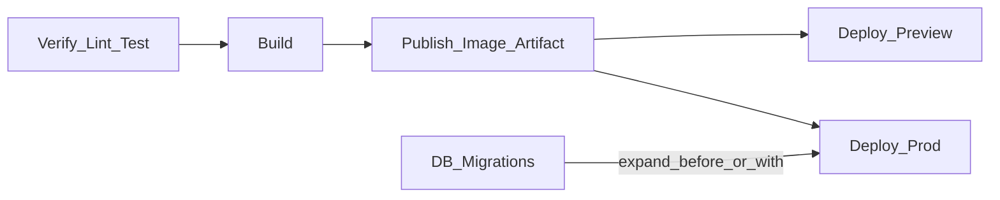

# Stages — стадии pipeline

> Актуальность: сентябрь 2026

## Роль в системе

Логические фазы поставки: проверить → собрать → опубликовать → выкатить. Архитектурно стадии отделяют «можно ли мержить» от «что именно едет в prod» и фиксируют порядок относительно миграций.

## Схема

## Что нужно знать (80/20)

- Verify: lint, types, unit/integration — fail fast до дорогой сборки
- Build: один воспроизводимый артефакт (image digest / bundle); не «соберём иначе на проде»
- Publish: registry / artifact store; теги + digest; сканирование — см. supply-chain
- Deploy: promote того же артефакта в env; отдельные credentials и approvals на prod
- Миграции: expand/contract относительно деплоя приложения — см. data-access/migrations
- Preview на PR vs prod: разные триггеры и секреты, желательно тот же build path
- Стадии можно параллелить (verify matrix), но контракт порядка publish→deploy не ломать

## Дочерние узлы

Пока нет — лист.

## Развилки

| Развилка | О чём спор (одна строка) |
| --- | --- |
| Promote artifact vs rebuild per environment | Идентичность бинарника vs простота «build на целевом» |
| Migrations in pipeline vs отдельный ops-runbook | Автоматизация vs контроль опасных DDL |

## Связанные узлы

- Родитель pipeline: [../](../)
- GitHub Actions: [../../platforms/github-actions/](../../platforms/github-actions/)
- Preview/rollout: [../../preview-rollout/](../../preview-rollout/)
- Migrations: [../../../03-data/data-access/migrations/](../../../03-data/data-access/migrations/)
- Dockerfile: [../../../04-infrastructure/containers/docker/dockerfile/](../../../04-infrastructure/containers/docker/dockerfile/)
- Environments: [../../../04-infrastructure/environments/](../../../04-infrastructure/environments/)
- Testing: [../../../06-quality/testing/](../../../06-quality/testing/)
