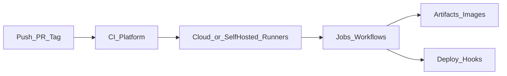

# CI/CD platforms

> Актуальность: сентябрь 2026

## Роль в системе

Где крутятся pipeline: GitHub Actions, GitLab CI, Buildkite, Circle, облачные build systems. Выбор связан с git-хостингом и runners.

## Схема

## Что нужно знать (80/20)

- **GitHub Actions** — массовый дефолт 2026 для GitHub-репозиториев
- Self-hosted vs cloud runners: cost, secrets, доступ к private network
- Переиспользуемые workflows / templates
- Лимиты минут и параллелизма — реальный constraint
- Связка с реестром образов и облачным IAM

## Дочерние узлы

- [github-actions](./github-actions/) — workflows, events, runners, secrets

Запланировано: gitlab-ci, runners.

## Развилки

| Развилка | О чём спор (одна строка) |
| --- | --- |
| Cloud runners vs self-hosted | Простота vs доступ к VPC и контроль cost |
| Monolith workflow vs reusable actions | Дублирование vs абстракции слишком рано |

## Связанные узлы

- Pipeline: [pipeline](../pipeline/)
- Stages: [pipeline/stages](../pipeline/stages/)
- Hosting deploy: [04-infrastructure/hosting](../../04-infrastructure/hosting/)
- Supply chain: [supply-chain](../supply-chain/)
