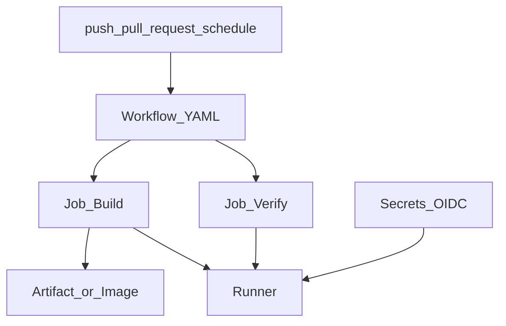

# GitHub Actions

> Актуальность: сентябрь 2026

## Роль в системе

CI/CD платформа GitHub: workflow as code в репозитории, триггеры на события git, jobs на runners. Архитектурно это место, где команда кодифицирует проверку и доставку — не «YAML ради YAML».

## Схема

## Что нужно знать (80/20)

- Workflow = triggers + jobs + steps; job по умолчанию изолирован (свой runner/workspace)
- Events: `pull_request`, `push`, `workflow_dispatch`, `schedule` — разные гарантии и секреты
- Cloud runners vs self-hosted: минуты, железо, доступ к private network / registry
- Secrets и variables; OIDC к облаку вместо долгоживущих deploy keys — см. supply-chain
- Reusable workflows / composite actions — борьба с копипастой; слишком рано — непрозрачность
- Кэш зависимостей и matrix — ускорение vs стоимость и flaky
- Permissions least privilege на `GITHUB_TOKEN`; fork PR не должны получать prod secrets

## Дочерние узлы

Пока нет — лист.

## Развилки

| Развилка | О чём спор (одна строка) |
| --- | --- |
| Everything in one workflow vs many small | Обзорность vs параллелизм и ownership |
| Marketplace actions vs own scripts | Скорость старта vs pin/supply-chain риск |

## Связанные узлы

- Родитель platforms: [../](../)
- Pipeline stages: [../../pipeline/stages/](../../pipeline/stages/)
- Supply chain: [../../supply-chain/](../../supply-chain/)
- Preview/rollout: [../../preview-rollout/](../../preview-rollout/)
- Docker: [../../../04-infrastructure/containers/docker/](../../../04-infrastructure/containers/docker/)
