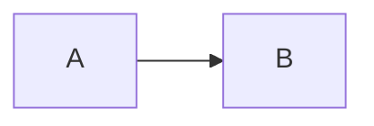

# Конвенции справочника

Правила, по которым устроен этот репозиторий. Соблюдай их при добавлении новых узлов.

## Цель

Справочник отвечает на вопрос: **что нужно понимать**, чтобы принимать архитектурные решения. Не «как написать код», а «какую роль играет слой / технология / развилка».

## Структура

- Корень репозитория = справочник.
- Имена папок — **английские слаги** (`frontend`, `react`, `cicd`).
- Заголовки и текст внутри — **русский**.
- Каждая папка открывается в `README.md` — карта узла.
- Нумерация верхнего уровня (`00-` … `07-`) фиксирует порядок чтения слоёв, не приоритет важности.

## Шаблон узла (`README.md`)

Каждый узел содержит блоки в этом порядке:

1. `# Название` + строка актуальности
2. `## Роль в системе`
3. `## Схема` — fenced-блок `mermaid` (см. ниже; опускается, если нет потока/границы/слоёв)
4. `## Что нужно знать (80/20)`
5. `## Дочерние узлы`
6. `## Развилки` — таблица «развилка | о чём спор»
7. `## Связанные узлы`

Пример блока схемы:

~~~markdown
## Схема

~~~

Блок `## Схема` обязателен, если узел про **поток, границу или структуру слоёв**. Иначе блок можно опустить (не ставить пустой заголовок).

### Правила заполнения

1. **Роль** — зачем в системе, не «что умеет библиотека».
2. **Схема** — одна основная диаграмма Mermaid; см. раздел «Схемы (Mermaid)» ниже.
3. **80/20** — только то, без чего нельзя принимать решения на этом уровне. Детали реализации — в будущий `GUIDE.md`.
4. **Развилки** — имя + одна строка «о чём спор». Без таблиц «когда выбирать» и без рекомендаций на этом этапе.
5. **Связанные узлы** — у каждой сквозной темы (auth, cache, observability) одно **каноническое** место; остальные ссылаются «см. также».
6. Объём карты — примерно **один экран**. Если не влезает — дроби узел.

## Схемы (Mermaid)

- Только **Mermaid** внутри `README.md`. Без PNG/SVG-ассетов, Excalidraw и внешних картинок на этом этапе.
- Место: `## Схема` сразу после `## Роль в системе`, до 80/20.
- Одна основная диаграмма на узел. Сравнение двух моделей — два коротких `subgraph`, не две огромные схемы.
- Типы по умолчанию: `flowchart` / `flowchart LR` (слои, границы); `sequenceDiagram` (путь запроса, handshake).
- ID узлов — camelCase / PascalCase, **без пробелов**. Подписи с спецсимволами — в двойных кавычках.
- Не использовать `style`, `classDef` и явные цвета (ломают dark mode на GitHub).
- Новые листья позвоночника (Next, Postgres, Auth, Docker и т.п.) со схемой сразу, если тема пространственная. Массовый ретрофит всех карт не обязателен.

## Глубина дерева

| Уровень | Что там | Пример |
| --- | --- | --- |
| 0 | Слой системы | `01-frontend/` |
| 1–2 | Подобласть | `frameworks/`, `state/` |
| 3 | Технология / крупный концепт | `react/`, `postgres/`, `rest/` |
| 4+ | Лист (детальный узел) | `react/component/` |

Листья 4-го уровня создаём по мере наполнения. Пока достаточно перечислить их в родителе как запланированные (без пустых папок), кроме эталонного пути `react/component`.

## Будущее (пока не делаем)

Рядом с листом, когда одной карты мало:

- `GUIDE.md` — краткое объяснение + минимальный пример, только если без него нельзя понять архитектурный выбор.
- `examples/` — маленький подпроект / сниппет.

Пока эти файлы **не создавать**.

## Язык и тон

- Русский, коротко, без маркетинга.
- Технологии называть каноническими именами: React, PostgreSQL, GitHub Actions.
- «Дефолт индустрии» помечать явно как ориентир, не как истину.
- Дата актуальности в узле: `> Актуальность: сентябрь 2026`.

## Чего здесь нет

- Полных курсов и туториалов
- Awesome-листов ссылок без карты
- Канонического «единственно верного» стека
- Генератора сайта документации
